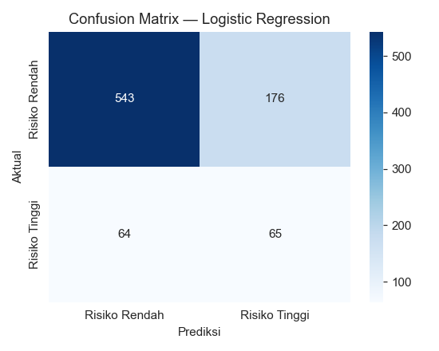
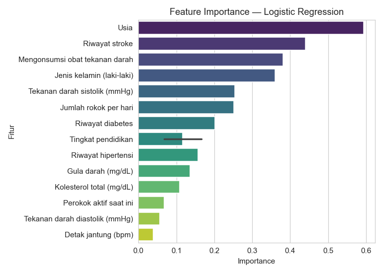
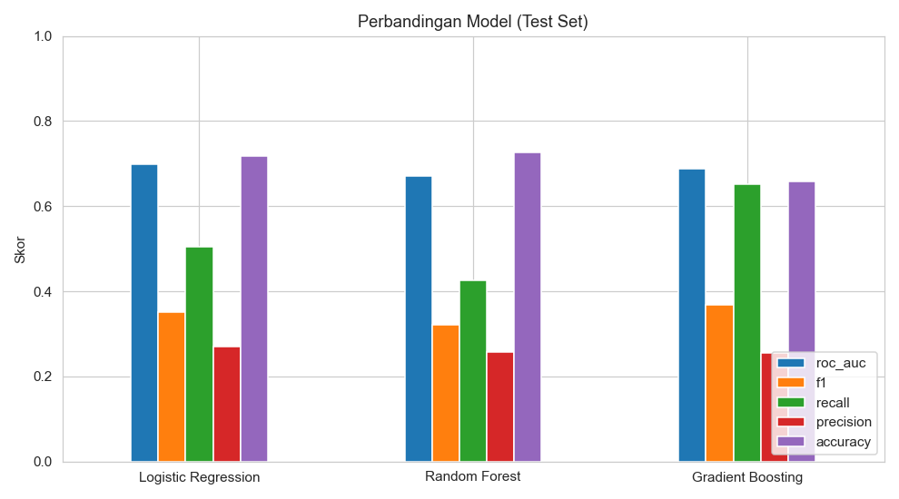

# Smoking Health Risk Prediction

Prediksi **risiko penyakit jantung koroner (CHD) dalam 10 tahun** berdasarkan data kesehatan dan kebiasaan merokok, menggunakan dataset **Framingham Heart Study** dan model machine learning.

> ⚠️ **Disclaimer**: Hasil model adalah estimasi statistik risiko kesehatan, **bukan diagnosis medis** dan bukan prediksi pasti umur/kematian. Selalu konsultasikan dengan tenaga medis profesional.

## 1. Project Overview

Project ini mendemonstrasikan pipeline machine learning end-to-end untuk klasifikasi risiko kesehatan:

- Data preprocessing dan cleaning
- Exploratory Data Analysis (EDA)
- Model comparison + hyperparameter tuning (GridSearchCV)
- Evaluasi menggunakan ROC-AUC, F1, Recall, Precision, Accuracy, Confusion Matrix
- Feature importance / explainability
- Deployment interaktif menggunakan **Streamlit** (Bahasa Indonesia)
- Notebook **Google Colab** untuk reproduksi via Google Drive

## 2. Problem Statement

Penyakit jantung koroner (CHD) adalah salah satu penyebab kematian utama di dunia. Kebiasaan merokok, tekanan darah tinggi, kolesterol, dan diabetes merupakan faktor risiko utama yang dapat diukur. Tujuan project ini adalah membangun model klasifikasi biner yang dapat **mengestimasi probabilitas seseorang mengalami CHD dalam 10 tahun** berdasarkan data klinis dan perilaku.

## 3. Dataset

Dataset yang digunakan adalah **Framingham Heart Study**, salah satu studi kohort epidemiologi terlama (dimulai 1948).

| Info | Detail |
|------|--------|
| Jumlah data | 4.240 baris |
| Jumlah fitur | 15 |
| Target | `TenYearCHD` (0 = risiko rendah, 1 = risiko tinggi) |
| Class balance | ~85% risiko rendah, ~15% risiko tinggi (imbalanced) |
| Missing values | Ada (ditangani via imputasi di pipeline) |
| Sumber | Framingham Heart Study (publik) |

## 4. Features

**Numerik:**
- `age` — Usia
- `cigsPerDay` — Jumlah rokok per hari
- `totChol` — Kolesterol total (mg/dL)
- `sysBP` — Tekanan darah sistolik (mmHg)
- `diaBP` — Tekanan darah diastolik (mmHg)
- `BMI` — Indeks Massa Tubuh
- `heartRate` — Detak jantung (bpm)
- `glucose` — Gula darah (mg/dL)

**Kategorikal:**
- `male` — Jenis kelamin (1 = laki-laki)
- `education` — Tingkat pendidikan (1-4)
- `BPMeds` — Mengonsumsi obat tekanan darah
- `prevalentStroke` — Riwayat stroke
- `prevalentHyp` — Riwayat hipertensi
- `diabetes` — Riwayat diabetes
- `currentSmoker` — Perokok aktif saat ini

## 5. Exploratory Data Analysis

Beberapa temuan EDA:

- Dataset memiliki **missing values** pada `glucose` (388), `education` (105), `cigsPerDay` (29), `BPMeds` (53), `totChol` (50), `BMI` (19), `heartRate` (1).
- Tidak ada duplikat.
- Target sangat **imbalanced**: hanya ~15% kelas risiko tinggi.
- Distribusi `cigsPerDay` dan `age` cenderung miring ke kanan.
- Perokok memiliki proporsi risiko tinggi yang lebih besar dibanding non-perokok.

## 6. Machine Learning Pipeline

Pipeline preprocessing dibangun menggunakan `ColumnTransformer` di dalam `Pipeline` sklearn agar hanya di-fit pada data latih dan konsisten saat inference:

| Fitur | Preprocessing |
|-------|---------------|
| Numerik | Imputasi median + StandardScaler |
| Kategorikal | Imputasi modus + OneHotEncoder (`drop='if_binary'`) |

**Model yang dibandingkan:**
1. Logistic Regression
2. Random Forest
3. Gradient Boosting

**Hyperparameter tuning:** `GridSearchCV` dengan scoring `roc_auc` dan 5-fold cross-validation pada train set.

**Threshold optimization:** Threshold klasifikasi dipilih dari **out-of-fold CV** (maksimum F1) untuk mengatasi class imbalance, tanpa menyentuh test set.

## 7. Model Evaluation

Model terbaik dipilih berdasarkan **ROC-AUC test set** karena dataset imbalanced.

### Hasil Final (Test Set)

| Model | ROC-AUC | Accuracy | Precision | Recall | F1 | Threshold |
|-------|---------|----------|-----------|--------|----|-----------|
| **Logistic Regression** | **0.699** | 0.717 | 0.270 | 0.504 | 0.351 | 0.55 |
| Random Forest | 0.671 | 0.726 | 0.258 | 0.426 | 0.322 | 0.20 |
| Gradient Boosting | 0.687 | 0.659 | 0.256 | 0.651 | 0.368 | 0.15 |

**Model terbaik: Logistic Regression** (ROC-AUC 0.699, Recall 0.504)

> Semua angka berasal dari eksperimen aktual yang dijalankan, bukan asumsi.

### Visualisasi







## 8. Prediction Example

Input: Pria 52 tahun, perokok 30 batang/hari, hipertensi, diabetes, kolesterol 260 mg/dL, tekanan darah 160/95 mmHg, BMI 31.

Output model:
- Probabilitas risiko CHD 10 tahun: **~85.7%**
- Kategori: **Risiko Tinggi**

> Ini hanya estimasi statistik; bukan diagnosis.

## 9. Streamlit Application

Aplikasi Streamlit memiliki 4 halaman:

1. **Beranda** — Penjelasan project, dataset, cara kerja, disclaimer
2. **Prediksi Risiko** — Form input data kesehatan, probabilitas risiko, dan penjelasan
3. **Analisis Data** — Visualisasi distribusi, hubungan smoking vs target, metrics model
4. **Tentang Model** — Detail preprocessing, model, metrics, dan keterbatasan

## 10. Installation

```bash
git clone https://github.com/username/smoking-health-risk.git
cd smoking-health-risk
python -m venv venv
source venv/bin/activate   # Windows: venv\Scripts\activate
pip install -r requirements.txt
```

## 11. How to Run

### Training
```bash
python -m src.train
```

Output:
- `models/model.joblib`
- `models/metrics.json`
- `assets/confusion_matrix.png`
- `assets/feature_importance.png`
- `assets/model_comparison.png`

### Streamlit App

Jika `streamlit` sudah terdaftar di PATH:
```bash
streamlit run app.py
```

Jika command `streamlit` tidak ditemukan (terutama setelah `pip install --user`), gunakan:
```bash
python -m streamlit run app.py
```

### Google Colab
Buka `notebooks/smoking_health_risk_colab.ipynb` di Google Colab. Upload `data/framingham.csv` ke Google Drive, lalu sesuaikan `DATA_PATH` di notebook.

## 12. Project Structure

```
smoking-health-risk/
│
├── data/
│   ├── framingham.csv
│   └── README.md
│
├── notebooks/
│   ├── smoking_health_risk_colab.ipynb
│   └── contoh/
│       └── student_performance_colab.ipynb
│
├── src/
│   ├── __init__.py
│   ├── config.py
│   ├── preprocessing.py
│   ├── train.py
│   └── predict.py
│
├── models/
│   ├── model.joblib
│   └── metrics.json
│
├── assets/
│   ├── confusion_matrix.png
│   ├── feature_importance.png
│   └── model_comparison.png
│
├── app.py
├── requirements.txt
├── README.md
└── .gitignore
```

## 13. Limitations

1. **Bukan diagnosis medis** — hanya estimasi statistik.
2. **Populasi dataset terbatas** — mayoritas warga Framingham, Massachusetts (mayoritas kulit putih), sehingga generalisasi ke populasi lain terbatas.
3. **Class imbalance** — model mungkin lebih akurat memprediksi risiko rendah dibanding risiko tinggi.
4. **Faktor tidak tercakup** — genetik, riwayat keluarga, dan gaya hidup detail tidak tersedia di dataset.
5. **Feature importance ≠ kausalitas** — importance menunjukkan asosiasi dengan prediksi, bukan hubungan sebab-akibat.

## 14. Future Improvements

- Eksplorasi model boosting (XGBoost, LightGBM, CatBoost)
- Teknik resampling (SMOTE) untuk class imbalance
- Interpretabilitas per-sampel menggunakan SHAP
- Integrasi data eksternal (genetik, riwayat keluarga)
- Deployment cloud (Streamlit Cloud / Hugging Face Spaces)
- Monitoring drift model

## License

Project ini untuk tujuan edukasi dan portfolio. Dataset merujuk ke sumber publik.
